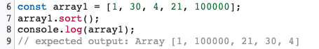

---

## 실패율, 프로그래머스 Level 1

문제 👉🏻 https://programmers.co.kr/learn/courses/30/lessons/42889

전체 스테이지의 개수 N, 게임을 이용하는 사용자가 현재 멈춰있는 스테이지의 번호가 담긴 배열 stages가 매개변수로 주어질 때, 실패율이 높은 스테이지부터 내림차순으로 스테이지의 번호가 담겨있는 배열을 return 하도록 solution 함수를 완성하는 문제이다.

여기서 실패율은 다음과 같이 정의한다.

**실패율 = 스테이지에 도달했으나 아직 클리어하지 못한 플레이어의 수 / 스테이지에 도달한 플레이어 수**

이 문제를 풀고나서 기록해두려는 이유는 크게 두 가지이다.

1. `sort` 함수의 사용
2. **유사배열객체**의 정렬

사실 이전에 `sort` 함수는 다른 언어에서도 많이 사용해보았는데, 사용할 때마다 그저 정렬하기에만 급급해서 `compare` 함수의 리턴값에 따라 어떻게 정렬되는지 제대로 이해하지 않고 코드 일부분을 가져다 쓰는 식이었다. ~~아주 쓰레기 같은 학습방법이었다.~~

그런 **지식의 부채**가 이번 문제를 풀면서 나를 제대로 한방 먹였다.

문제를 보기 전에 간단하게 짚고 넘어가보자.

### 자바스크립트의 `sort`

JS에서 `sort`는 다른 언어와는 조금 다르게 동작한다.



`array1`을 정렬하면 **_1,4,21 ..._** 순으로 정렬되어야 하는 것이 아닌가?

JS에서 `sort`의 정렬 순서는 기본적으로 문자열의 유니코드 코드 포인트를 따른다고 한다.

그리고, `sort`의 매개변수로는 `compareFunction`이 필요하다.

즉, `compareFunction`을 인자로 넘겨주지 않으면 우리가 아는 일반적인 정렬 순서가 아니라 유니코드 코드순서대로 정렬하는 것이다.

그래서 `compareFunction`을 어떻게 정의해야 할까?

간단하게 요약하면 **`compareFunction`의 인자로 `a`, `b`를 넘겨주고 0보다 작은 수를 리턴하면 `a`를 `b`보다 우선순위로 정렬한다.**

그렇다면 내림차순으로 정렬하려면 `compareFunction`의 리턴값을 0보다 크게 만들어줘야한다.

자세한건 공식문서를 [참고](https://developer.mozilla.org/ko/docs/Web/JavaScript/Reference/Global_Objects/Array/sort#%EC%84%A4%EB%AA%85)하자.

중요한 것은 자바스크립트의 `sort`는 일반적으로 작동하지 않는다(다른 언어처럼).

**일반적으로 원하는 결과를 얻으려면 반드시 `compareFunction`을 정의해주자.**

### 유사배열객체의 정렬

그렇다면 배열이 아닌, 객체(유사배열)는 어떻게 정렬할까?

그냥 `object`에 dot opeartor로 접근해서 `sort`를 찍어보면 에러가 발생한다.

객체의 프로토타입에는 `sort` 메서드가 없기 때문이다.

내가 원하는 정렬은 객체의 value를 바탕으로 key를 정렬하는 것이다.

그렇다면 이런 아이디어로 접근할 수 있다.

먼저 **객체의 keys를 배열로 얻고** sort 함수의 인자로는<br>
그냥 매개변수 `a`, `b`가 아닌 **`object[a]`, `object[b]`로 `compareFunction`을 주자.**

### 문제 풀이

```javascript
function solution(N, stages) {
  let failureRate = {}
  // 실패율 구하기
  for (let i = 1; i <= N; i++) {
    let current = i
    let failCount = 0 // 스테이지에 도달했으나 아직 클리어하지 못한 플레이어 수
    let playerCount = 0 // 스테이지에 도달한 플레이어 수
    stages.forEach(stage => {
      if (current <= stage) playerCount += 1
      if (current + 1 > stage && stage >= current) failCount += 1
    })
    failureRate[i] = failCount / playerCount
  }
  // 실패율에 따른 스테이지 정렬
  let failRateStage = Object.keys(failureRate)
  failRateStage.sort((a, b) => failureRate[b] - failureRate[a])
  let answer = failRateStage.map(key => Number(key))
  return answer
}
```

위에서 객체의 정렬은 어떻게 할 것인지로부터 나온 아이디어의 적용이 바로 다음의 코드이다.

` failRateStage.sort((a, b) => failureRate[b] - failureRate[a])`

알고리즘 문제를 풀면서 해시를 사용하기 위해 key-value로 이루어진 JS object를 쓸 일이 많은데,

이 object의 정렬을 알고 있으면 문제 풀이가 한결 수월해질 것이다.
